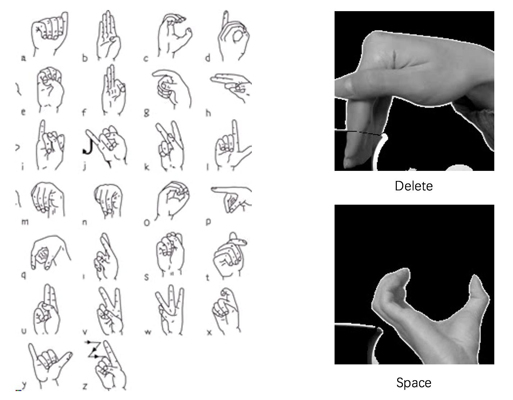

# SignNet

### [Report](report/report.pdf) |[Pretrained Model](https://drive.google.com/file/d/1NWdutIu9o8DqLA8tXTNbyiF5rw1IQK5X/view)| [Demo]()

**SignNet: Recognize Alphabets in the American Sign Language in Real Time**

[Zeqiang Lai](https://github.com/Zeqiang-Lai) , [Zhiyuan Liang](https://github.com/zhiyuan0112) , [Kexiang Huang](https://github.com/YellCanFly)

Beijing Institute of Technology

> Note that this is a simple course project rather than a serious research project.

## Getting Started

1. **Clone the repository**

```shell
git clone https://github.com/Zeqiang-Lai/SignNet.git
```

2. **Install the requirements**, see [requirement section](#requirement) for instruction.

3. **Download pretrained model**
   - [BaiduNetDisk](https://pan.baidu.com/s/1tjQI-qaErX0y8Cr7uKxIYw), Code:  l12u
   - [Google Drive](https://drive.google.com/file/d/1NWdutIu9o8DqLA8tXTNbyiF5rw1IQK5X/view)
4. **Unzip pretrained model and put it into 'signnet' directory**
5. **Run the live demo**

```shell
python live_demo.py
```

## Requirement

- OpenCV
- QT
- Python3

**Install the Python requirement using the following command.**

```shell
cd signnet
conda env create -f env.yaml
```

## Gestures

The gestures for the sign alphabets we used are a little **differnt** from what it is shown in the header image. Our version can be shown in the following pictures.



The total alphabets our model can recognitize includes **26 letters, space and delete** (control operator).

## Datasets

The pretrained model was trained with [ASL Alphabet](https://www.kaggle.com/grassknoted/asl-alphabet) dataset, and there is another supplementary  [ASL Alphabet Test](https://www.kaggle.com/danrasband/asl-alphabet-test/home) dataset for testing.

## To Do

- [x] Record video demo
- [ ] Upload training and test data
- [ ] Finish report
- [ ] Integrate camera and text windows into a single one
- [ ] Complete test.py (testing) and demo.py (demo with static image)
- [ ] Tutorial for training

## Reference

This project is inspired by these related projects.

- [loicmarie](https://github.com/loicmarie)/**[sign-language-alphabet-recognizer](https://github.com/loicmarie/sign-language-alphabet-recognizer)**

